## `Terminal and Local JavaScript`
###  Steps to Run Project Locally
  1. From your terminal locate where you want to store your practice
  * This could be in your App Academy Folder
      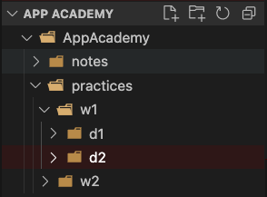
  2. `cd` into the folder
    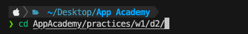
  3. Copy the tiged command from the github repo
    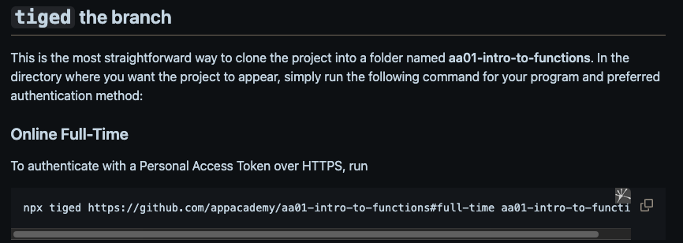
  4. Paste the command into your terminal
   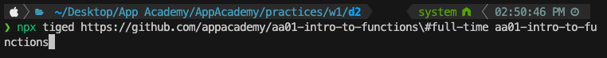
  5. `cd` into the file you just cloned
   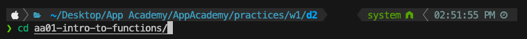
   `Make sure when you run ls this is what you see`
   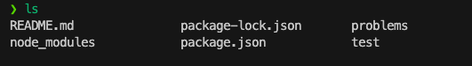
  6. Run npm install
  
  `No worries if you see vulnerabilities; that is normal`

# How to run file using node
  1. From the root of the directory
   * Run `node problems/<problemFileName>`
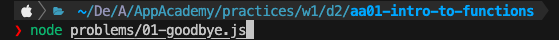
  Some things to note!
  - If there is no `console.log` nothing will print to the terminal
  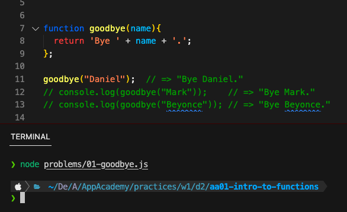
  - If there are errors in the code; errors will be printed to the terminal
   
    - Make sure to read your error messages carefully!
    - In this case, name is not defined!
  - If the function isnt called; the function will not run!
   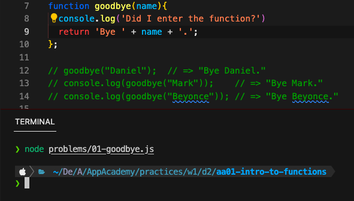

# How to run the test specs
## Running a single test spec
 1. From the root of the directory
   * Run `npm test test/<testFileName>`
  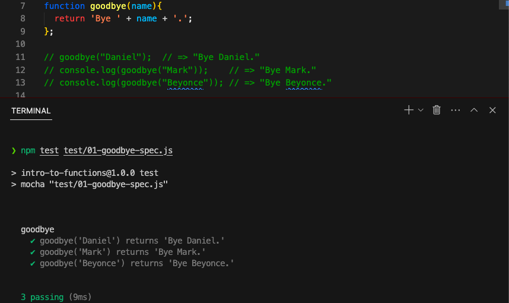
  Some things to note!
  * Make sure there are no errors in your code or the specs will break!
  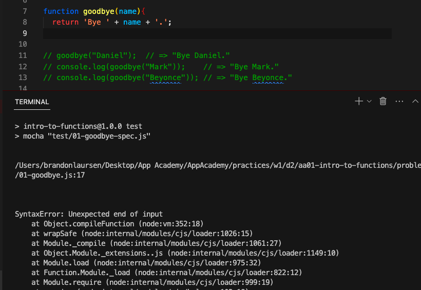
    * In this case we have a syntax error
  * Make sure youre at the root of your directory and not in the problems folder or you may see this
  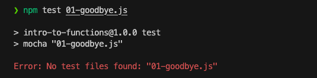
## Running all the test specs
* From the root of the directory
  * Run npm test
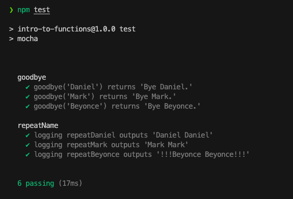

# Node
  ## What is node?
  - runtime environment that allows us to run js outside the browser

  ## What is node repl?
  - repl you can use to run quick test on your terminal
    * to exit use .exit

 ##  What is NPM?
  - Node package manager
    * Tool that allows developers to easily install, manage, and share JavaScript libraries and packages with other developers

  ## What is NVM?
  * Tool that allows us manage and change what version of node we are using

  ## What is a Package.json?
  * holds all the meta data of your project such as name, versions dependencies
  * Whenever you see a package.json you npm install to install the dependencies

  ## What is npm install?
  * How we install the dependencies within the package.Jason

  * When you npm install, two things are generated
    1. Package-lock.json
    2. Node_modules

  ## Package-lock.json
  * Keep track of dependencies and ensure all who download get the same tree of dependencies stores exact copy version

  * It describes the exact tree that was generated, such that subsequent installs are able to generate identical trees, regardless of intermediate dependency updates.

  ## Node_modules
  * Holds all the dependencies of your project
  ## What is mocha?
    * A testing framework for running js in node

  ## How to run mocha
  * when you run mocha, make sure youre at the root so that were able to go into the test folder

  ## Run a single test file
  * npm test test/filename

  ## Run all files
  * npm test

## Relative Path
  A relative path describes the location of a file relative to the current (working) directory*. 
## Absolute Path
  An absolute path describes the location from the root directory.

